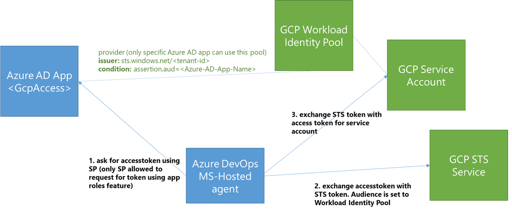

# Overview
This guide shows how to access GCP resources from Azure DevOps pipelines using Terraform and credentials from Workload Identity Federation: https://cloud.google.com/iam/docs/workload-identity-federation.
This flow requires no secret storing for GCP credenetials.

# Demo contents
The demo has two flows:
1. Self-Hosted pipelines: This is expected to run on Azure VM with a Managed Identity
2. MS Hosted Pipeline: This flow uses an Azure DevOps automated Service Principal (Service Connection). Because Terraform and GCP SDKs only support Managed Identity, this flow uses GCP REST API workflow.

# Running the demo
1. Fork this repo
2. Follow the steps here to setup the Azure and GCP components: https://cloud.google.com/iam/docs/configuring-workload-identity-federation#azure
3. Update all the values between angle brackets <> with the values mentioned 
4. Setup the Azure DevOps pipelines: https://docs.microsoft.com/en-us/azure/devops/pipelines/repos/github?view=azure-devops&tabs=yaml
5. Check the logs for details of access keys and STS tokens obtained
